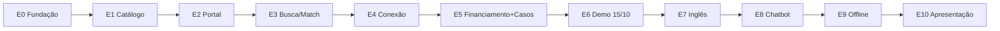

# Climate Action Connect — Requisitos de Desenvolvimento Final

> Plano técnico de execução com **etapas graduais que entregam valor a cada conclusão**.  
> Escopo e decisões travadas: [`requisito-final.md`](./requisito-final.md)  
> UX: [protótipo v9](./_MATERIAIS/materiais%20finais/Climate_Action_Connect_Prototipo_Validacao_Daniel_v9.html) · [site v13](./_MATERIAIS/materiais%20finais/Climate_Action_Connect_Preview_Site_Navegavel_v13_Consolidado.html)

**Versão:** 1.0 — final  
**Data:** 2026-09-04  
**Postura:** alta performance desde a Etapa 0 (fundação não cortável)  
**Marco 1:** 15/10/2026 · **Marco 2:** novembro/2026 *(data a registrar)*  
**Equipe:** 2 devs (Dev A = API/dados · Dev B = www/web/UX)

---

## Sumário

1. [Princípios de execução](#1-princípios-de-execução)
2. [Mapa das etapas e valor entregue](#2-mapa-das-etapas-e-valor-entregue)
3. [Arquitetura mínima (travada)](#3-arquitetura-mínima-travada)
4. [Etapas do Bloco A — até 15/10](#4-etapas-do-bloco-a--até-1510)
5. [Etapas do Bloco B — até novembro](#5-etapas-do-bloco-b--até-novembro)
6. [Distribuição por desenvolvedor](#6-distribuição-por-desenvolvedor)
7. [Ordem de sacrifício (se atrasar)](#7-ordem-de-sacrifício-se-atrasar)
8. [Checklists de aceite](#8-checklists-de-aceite)
9. [Definição de pronto por etapa](#9-definição-de-pronto-por-etapa)

---

## 1. Princípios de execução

| Princípio | Como aplica |
|---|---|
| **Valor a cada etapa** | Toda etapa termina com algo **demonstrável** (API, tela ou fluxo) — não só “código pronto” |
| **Fundação primeiro** | Monorepo, contratos, i18n, health, worker e CI nascem na Etapa 0 — sem atalho de MVP técnico |
| **Escopo = `requisito-final.md`** | Em conflito, o final prevalece |
| **Vertical slicing** | Preferir fatias ponta a ponta (api → UI) a camadas horizontais isoladas |
| **Seed como entregável** | Conteúdo da demo entra cedo e cresce; não fica para a última semana |
| **Congelar e mostrar** | Sexta de cada etapa = demo interna; 15/10 e novembro = demos formais |

```
Etapa N concluída → valor visível → Etapa N+1 sobe em cima do que já funciona
```

---

## 2. Mapa das etapas e valor entregue

### Bloco A — núcleo navegável (→ 15/10)

| Etapa | Período | Nome | Valor entregue ao concluir |
|---|---|---|---|
| **E0** | 02–06/set | Fundação operável | Stack sobe com 1 comando; login funciona; base pronta para crescer |
| **E1** | 09–13/set | Catálogo e identidade | Dá para cadastrar org, solução, desafio; representação institucional E2E |
| **E2** | 16–20/set | Portal navegável | Cliente “vê o produto”: Home com 5 caminhos + product-page + wizards |
| **E3** | 23–27/set | Busca e match | **Coração do CAC:** busca → score → explicação → 3 caminhos |
| **E4** | 30/set–04/out | Conexão e governança | Visitante vira ação: interesse → login → conexão → e-mail → aceite + admin |
| **E5** | 07–11/out | Financiamento e casos | **5 caminhos completos** na Home (ofertas × diretório + casos) |
| **E6** | 13–15/out | Demo hospedada | Seed curado + staging/prod → **entrega formal 15/10** |

### Bloco B — apresentação (→ novembro)

| Etapa | Período | Nome | Valor entregue ao concluir |
|---|---|---|---|
| **E7** | 16–24/out | Inglês funcional | Portal inteiro navegável em EN |
| **E8** | 27/out–07/nov | Chatbot CAC | Relato de problema → mesmos caminhos da busca |
| **E9** | 10–14/nov | Offline Docker | Demo sem internet + marca trocável |
| **E10** | semana da apresentação | Ensaio e freeze | Roteiro cronometrado pronto para a plateia |



---

## 3. Arquitetura mínima (travada)

Detalhes amplos em [`requisitos_dev.md`](./requisitos_dev.md). Aqui só o que as etapas precisam respeitar.

```
@cac/www  ─┐
@cac/web  ─┼── HTTP/JSON ──► @cac/api ──► MySQL + Redis + uploads
           │                      │
@cac/shared ◄─────────────────────┘
@cac/ui
                    api-worker ── embeddings + e-mail
```

| Regra | Implicação |
|---|---|
| Só a API toca dados | Frontends nunca acessam MySQL/Redis |
| Match = retorno da busca | Sem rota/tela `match` |
| Perfil fora do menu | Desktop e mobile: sem ícone Perfil na nav pública |
| Chatbot simples | Interpretação + `POST /api/search` — sem LLM obrigatório |
| Offline = mesmo build | `docker-compose.offline.yml` + `OFFLINE_MODE=true` |

**Stack:** Node ≥20 · Express 5 · Prisma 6 + MySQL 8 · Redis 7 · React 19 + Vite 7 · JWT cross-app · Docker + nginx.

**Ambientes:** `dev` · `staging` · `prod` · `offline`.

---

## 4. Etapas do Bloco A — até 15/10

Cada etapa tem: **objetivo · entregáveis · critério de pronto · valor demonstrável**.

---

### E0 — Fundação operável  
**02/09 – 06/09**

**Objetivo:** a fábrica de software existe e sobe estável.

| Entregáveis | Responsável |
|---|---|
| Monorepo `apps/{api,www,web}` + `packages/{shared,ui}` | A+B |
| Docker Compose: mysql, redis, api, api-worker, www, web | A |
| Prisma migration v1 + seed mínimo de domains | A |
| Auth: register / login / refresh / me + RBAC | A |
| Layouts www/web + tokens v13 + i18n keys (sem string hardcoded) | B |
| Branding por env (`APP_BRAND_*`) | B |
| `/health` + `/ready` + CI lint/test skeleton | A |
| Cookie cross-app + CORS dual origin | A+B |

**Pronto quando:**
- [ ] `docker compose up` sobe api + worker + www + web + mysql + redis
- [ ] Login no web funciona e `/me` responde
- [ ] Nenhuma string de UI hardcoded (i18n desde o dia 1)
- [ ] Estilo CSS escolhido e travado (Tailwind **ou** CSS modules)

**Valor demonstrável:**  
> “A plataforma existe: sobe local, autentica e já está preparada para i18n e troca de marca.”

---

### E1 — Catálogo e identidade  
**09/09 – 13/09**

**Objetivo:** a base de conteúdo e a governança institucional existem via API (+ telas de auth/representação).

| Entregáveis | Responsável |
|---|---|
| Organizations CRUD + members + slug | A |
| Domains com `country` ISO completo + region | A |
| Technologies CRUD + workflow `DRAFT→IN_REVIEW→PUBLISHED` | A |
| Challenges CRUD + `need_type` | A |
| Projects (`PROJECT\|INITIATIVE\|POLICY\|PROGRAMME`) | A |
| Upload de mídia (api) | A |
| `OrgRepresentationRequest` (conta→vínculo→validar→permissões) | A |
| Schemas Zod em `@cac/shared` | A |
| web: `/register`, `/login`, wizard de representação | B |
| Testes: auth + representação | A |

**Pronto quando:**
- [ ] Criar org, solução e desafio via API (com testes)
- [ ] Representação institucional E2E no web até selo verificado (fluxo manual admin)
- [ ] Conteúdo só entra como publicado após workflow

**Valor demonstrável:**  
> “Já cadastramos soluções e desafios com identidade institucional — não basta se declarar Embrapa.”

---

### E2 — Portal navegável  
**16/09 – 20/09**

**Objetivo:** o cliente reconhece o produto visualmente (v13), mesmo sem match completo.

| Entregáveis | Responsável |
|---|---|
| www Home: banner + busca + **5 caminhos** | B |
| Nav sem Perfil (desktop + mobile `Início·Buscar·Desafio·Casos`) | B |
| Product-page da solução + informações complementares | B |
| Páginas: organização, desafio, projeto | B |
| web wizards: “Publique e divulgue” + “Publique um desafio” | B |
| Redirect contextual www→web em ações de escrita | B |
| Seed parcial: ≥5 soluções + ≥3 orgs + ≥3 desafios | A |
| Responsivo básico (breakpoints do protótipo) | B |

**Pronto quando:**
- [x] Percorrer Home → detalhe de solução → wizard de desafio sem quebrar
- [x] Nav pública sem Perfil em desktop e mobile
- [x] Rótulos alinhados ao `requisito-final.md`

**Valor demonstrável:**  
> “O protótipo virou aplicação: a Home dos 5 caminhos está no ar e dá para publicar oferta/desafio.”

---

### E3 — Busca e match (coração do produto)  
**23/09 – 27/09**

**Objetivo:** entregar o diferencial — correspondência explicável.

| Entregáveis | Responsável |
|---|---|
| `EmbeddingProvider` + fila Redis + worker | A |
| `POST /api/search`: keyword + **8 filtros** + interpretação | A |
| Score v1 (pesos configuráveis) + `factors[]` + `MATCH_MIN_SCORE=60` | A |
| `facets` por `content_type` | A |
| 3 caminhos: `whoCanSolve` · `whoCanFund` · `relatedProjects` | A |
| **Proibido** `whoCanImplement` | A |
| www: SearchPage, ResultCard, ResultFacets, ScoreExplanation, MatchPaths | B |
| Seed ampliado para cenário-âncora | A |
| Testes do score e fallback keyword | A |

**Pronto quando:**
- [x] Busca *“recuperação de pastagens em seca”* retorna scores demonstrativos (meta 94/89/83)
- [x] Painel *“Por que X%?”* com ≥3 fatores
- [x] Composição do resultado visível
- [x] Os 3 caminhos na UI — nenhum “quem pode implementar”

**Valor demonstrável:**  
> “Do problema ao caminho de ação: a busca ranqueia, explica e mostra quem resolve, quem financia e projetos relacionados.”

---

### E4 — Conexão e governança  
**30/09 – 04/10**

**Objetivo:** fechar o ciclo de valor — da recomendação à ação humana.

| Entregáveis | Responsável |
|---|---|
| Connection com `targetType` + `targetId` + objetivo | A |
| State machine: pendente → aceita/recusada/expirada | A |
| E-mails: solicitação, aceite, recusa, lembrete, expiração | A |
| SavedItem + Follow | A |
| web: solicitar conexão, `/my/connections` | B |
| Admin: fila de curadoria unificada | B |
| Admin: aprovar representação + KPIs + CRUD domains | B |
| www: CTAs Interesse / Favoritar / Solicitar no detalhe | B |

**Pronto quando:**
- [x] www → interesse no item → login → solicitação → e-mail → aceite
- [x] Curador aprova conteúdo na fila
- [x] Admin edita país/região

**Valor demonstrável:**  
> “Não é só vitrine: dá para conectar sobre um item concreto e o ofertante responde por e-mail.”

---

### E5 — Financiamento e casos (5 caminhos completos)  
**07/10 – 11/10**

**Objetivo:** completar as portas 02 e 05 da Home.

| Entregáveis | Responsável |
|---|---|
| `FundingOffer` (ativa, prazo, matching) + auto-cadastro | A |
| `FunderProfile` (diretório) + aviso “≠ chamada aberta” | A |
| `SuccessCase` + evidências + necessidades + curadoria | A |
| Entrada de ofertas e casos no índice de busca | A |
| www `/funding` com 2 abas | B |
| www `/cases` + `/cases/:slug` | B |
| web wizards: oferta de financiamento + caso | B |

**Pronto quando:**
- [x] Os 5 caminhos da Home levam a fluxos reais
- [x] Oferta ativa participa do match; diretório não
- [x] Caso Moçambique (ou equivalente) com evidências

**Valor demonstrável:**  
> “Financiamento e conhecimento entram no mesmo jogo da busca — a Home está completa.”

---

### E6 — Demo hospedada (Marco 1)  
**13/10 – 15/10**

**Objetivo:** entregar formalmente o núcleo navegável.

| Entregáveis | Responsável |
|---|---|
| `scripts/seed.ts` nos volumes do `requisito-final.md` §12 | A |
| Embeddings pré-calculados | A |
| nginx + `docker-compose.prod.yml` | A |
| Staging + prod espelhados, TLS, backup MySQL | A |
| Smoke do checklist Marco 1 | A+B |
| Ensaio cronometrado (~20 min) | A+B |
| Freeze do núcleo | A+B |

**Pronto quando:**
- [x] Checklist §8.1 100% verde
- [x] Ambiente hospedado acessível na demonstração
- [x] Roteiro ensaiado sem falha bloqueante

**Valor demonstrável (15/10):**  
> Entrega formal ao cliente — jornada completa em ambiente hospedado.

**Status E6 (2026-09-06):** **PASS** — ver `_REQUISITOS/aceite-e6-run.md` · gateway `:8080`.

**Roteiro da demo (~20 min):**

1. Home (5 caminhos)  
2. Busca âncora → scores + composição  
3. Product-page + “Por que 94%?”  
4. 3 caminhos do match  
5. Financiamento (2 abas)  
6. Caso de sucesso  
7. Publicar desafio  
8. Conexão sobre o item  
9. Admin (curadoria + KPIs + domains)

---

## 5. Etapas do Bloco B — até novembro

---

### E7 — Inglês funcional  
**16/10 – 24/10**

**Objetivo:** apresentar o produto em EN sem reescrever telas.

| Entregáveis | Responsável |
|---|---|
| `ContentTranslation` + `?lang=` com fallback PT | A |
| Catálogo EN completo (www + web + e-mails) | B |
| `LangSwitch` preservando rota e filtros | B |
| Tradução do seed demonstrativo | A+B |

**Pronto quando:**
- [ ] Percorrer a jornada âncora inteira em inglês
- [ ] Alternar PT↔EN sem perder contexto

**Valor demonstrável:**  
> “A mesma plataforma fala inglês — pronta para plateia internacional.”

---

### E8 — Chatbot CAC (escopo simples)  
**27/10 – 07/11**

**Objetivo:** conversar sobre o problema usando o **mesmo** motor de busca.

| Entregáveis | Responsável |
|---|---|
| `POST /api/chat/message` → interpretação por regras → `search` | A |
| Guardrails: só consulta a base; sem voz; sem LLM obrigatório | A |
| www: “Converse com a CAC” (desktop + mobile) | B |
| Encaminhamento para resultados / detalhe | B |

**Pronto quando:**
- [ ] Relato de seca → caminhos (soluções, projetos, financiamento, casos)
- [ ] Chatbot não inventa fora da base

**Valor demonstrável:**  
> “Dá para conversar com a CAC e chegar aos mesmos caminhos da busca.”

---

### E9 — Offline Docker + marca  
**10/11 – 14/11**

**Objetivo:** demo sem internet e portabilidade de marca.

| Entregáveis | Responsável |
|---|---|
| `docker-compose.offline.yml` + dump + embeddings | A |
| `OFFLINE_MODE=true` (KeywordFallback / sem OpenAI) | A |
| Pacote `.tar` + runbook 1 comando | A |
| Troca de nome/logo por config (smoke) | B |
| Checklist de paridade vs. staging | A+B |

**Pronto quando:**
- [ ] Executar a demo em máquina sem rede
- [ ] Marca alterada sem rebuild de código

**Valor demonstrável:**  
> “Mesmo se a rede falhar, a apresentação roda — e a marca pode ser ONU ou Embrapa.”

---

### E10 — Ensaio e freeze  
**Semana da apresentação**

**Objetivo:** zero surpresa na plateia.

| Entregáveis | Responsável |
|---|---|
| Revisão profissional dos textos EN | externo / B |
| Curadoria final do seed | A+B |
| Ensaio completo (itens 1–11 do roteiro) | A+B |
| Freeze de código e conteúdo | A+B |
| Plano B = offline | A |

**Pronto quando:**
- [ ] Checklist §8.2 verde
- [ ] Tempo do roteiro dentro de ~20–25 min

**Valor demonstrável (novembro):**  
> Apresentação institucional com EN + chatbot + offline.

---

## 6. Distribuição por desenvolvedor

| | Dev A (API / dados) | Dev B (www / web / UX) |
|---|---|---|
| E0 | Compose, Prisma, auth, health, CI | Layouts, tokens, i18n, branding |
| E1 | CRUD entidades + representação API | Auth UI + wizard representação |
| E2 | Seed parcial, APIs de leitura | Home 5 caminhos, product-page, wizards |
| E3 | Search, score, embeddings, facets | Search UI, score, caminhos |
| E4 | Connections, e-mail, Saved/Follow | Fluxos conexão + admin |
| E5 | FundingOffer, SuccessCase, índice | `/funding`, `/cases`, wizards |
| E6 | Seed final, prod, nginx, backup | Ensaio, polish UI |
| E7 | ContentTranslation | Catálogo EN + LangSwitch |
| E8 | `/chat/message` | UI Converse com a CAC |
| E9 | Offline compose + dump | Smoke marca + paridade UI |
| E10 | Freeze + plano B | Ensaio + textos |

---

## 7. Ordem de sacrifício (se atrasar)

**Nunca sacrificar:** fundação (E0) · busca com score explicável · 5 caminhos · conexão sobre o item · offline (E9) · i18n estrutural.

### Atraso no Bloco A (>2 dias)

1. Score só keyword + tags (mantendo `factors[]`)  
2. KPIs por contadores SQL simples  
3. Casos sem workflow completo (publicação direta admin)  
4. Ofertas só via seed (adiar auto-cadastro)  
5. Último recurso: mesclar www+web  

### Atraso no Bloco B

1. P1 (export, histórico, feedback)  
2. Tradução automática de conteúdo (manter UI EN)  
3. Profundidade do chatbot (manter relato → search)

---

## 8. Checklists de aceite

### 8.1 Marco 1 — 15/10

- [x] Home: banner + busca + 5 caminhos  
- [x] Nav sem Perfil (desktop e mobile)  
- [x] Busca + 8 filtros + interpretação + composição  
- [x] Score + “Por que X%?” (≥3 fatores)  
- [x] 3 caminhos — sem “quem pode implementar”  
- [x] Product-page completa  
- [x] Financiamento: ativa × diretório  
- [x] Caso de sucesso com evidências  
- [x] Publicar desafio e publicar/divulgar solução  
- [x] Representação até verificado  
- [x] Conexão sobre o item + e-mail  
- [x] Favoritar / seguir  
- [x] Admin: curadoria + KPIs + domains  
- [x] Responsivo  
- [x] Hospedado + seed nos volumes finais  

### 8.2 Marco 2 — novembro

- [ ] Tudo do §8.1  
- [ ] EN funcional (textos revisados)  
- [ ] Chatbot simples sobre a base  
- [ ] Offline Docker sem internet  
- [ ] Marca trocável por config  
- [ ] Ensaio concluído  

---

## 9. Definição de pronto por etapa

Uma etapa só fecha se **todas** as linhas abaixo forem verdadeiras:

1. Entregáveis listados concluídos  
2. Critérios de pronto da etapa checados  
3. Valor demonstrável mostrado em demo interna (sexta)  
4. Nada que quebre a etapa anterior  
5. Itens abertos registrados (não “escondidos” no próximo sprint)

| Etapa | Demo interna (sexta) |
|---|---|
| E0 | 06/set — compose + login |
| E1 | 13/set — CRUD + representação |
| E2 | 20/set — portal 5 caminhos |
| E3 | 27/set — busca com score |
| E4 | 04/out — conexão E2E |
| E5 | 11/out — funding + casos |
| E6 | **15/out — entrega formal** |
| E7 | 24/out — portal em EN |
| E8 | 07/nov — chatbot |
| E9 | 14/nov — offline |
| E10 | dia da apresentação |

---

## Referências

| Documento | Papel |
|---|---|
| [`requisito-final.md`](./requisito-final.md) | Escopo e decisões travadas (**prevalece**) |
| Este arquivo (`requisito-dev-final.md`) | Etapas de desenvolvimento e valor incremental |
| [`requisitos_dev.md`](./requisitos_dev.md) | Detalhe técnico ampliado (API, modelo, contratos) |
| [`requisitos-apresentacao.md`](./requisitos-apresentacao.md) | Narrativa para stakeholders |
| Protótipos v9 + v13 | UX e copy |

> Em conflito de escopo: `requisito-final.md`. Em conflito de sequência de entrega: **este arquivo**.

---

*Requisitos de desenvolvimento final v1.0 — 2026-09-04. Cada etapa concluída deixa valor demonstrável no ar.*
